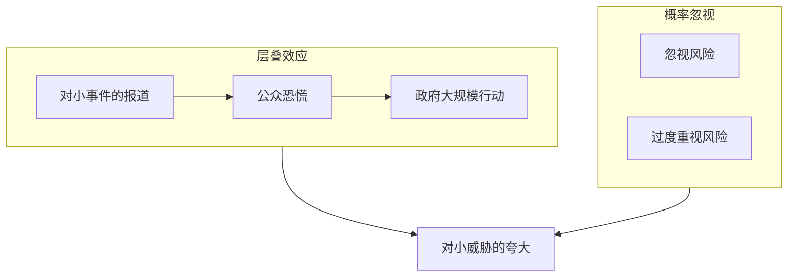

第 13 章 焦虑情绪和风险政策的制定

## 效用层叠
是一连串的自持事件，对此要事件的报道，引起公众恐慌，政府大规模行动

## 概率忽视

要么完全忽视风险，要么过于重视风险

```mermaid

flowchart TD
    subgraph G1 [层叠效应]
        A[对小事件的报道] --> B[公众恐慌] --> C[政府大规模行动]
    end

    subgraph G2 [概率忽视]
        忽视风险
        过度重视风险
    end

    D[对小威胁的夸大]
    G1 --> D
    G2 --> D 
```