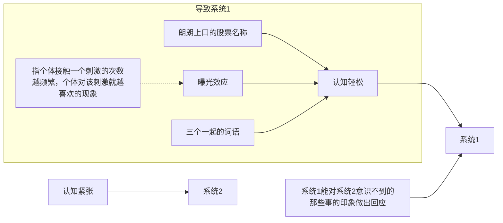
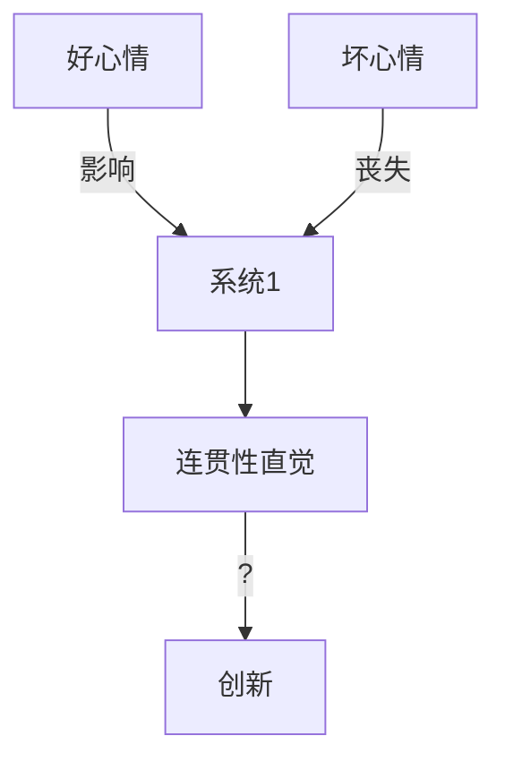

# 第 5 章 

## 股票代码上口，回报率也相对较高

```mermaid
flowchart LR
  A[认知轻松] --> S1[系统1]

  B[认知紧张] --> S2[系统2]
  
  subgraph 导致系统1
    C[朗朗上口的股票名称] --> A 
    D[曝光效应] --> A 
    E[三个一起的词语] --> A
    F[指个体接触一个刺激的次数越频繁，个体对该刺激就越喜欢的现象] -.-> D
  end
  
  G[系统1能对系统2意识不到的那些事的印象做出回应] --> S1
  %% 曝光效应：指个体接触一个刺激的次数越频繁，个体对该刺激就越喜欢的现象
  

```

## 创新是发生在能让人联想无限的环境中的

```mermaid

flowchart TD
  A[好心情] --> |影响| B[系统1]
  C[坏心情] --> |丧失| B
  B --> D[连贯性直觉]
  D -->|?| E[创新] 

```