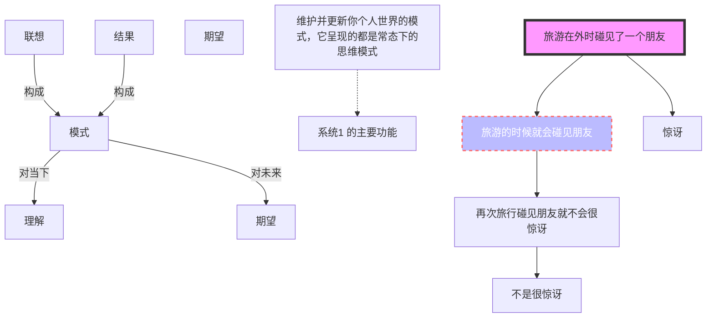
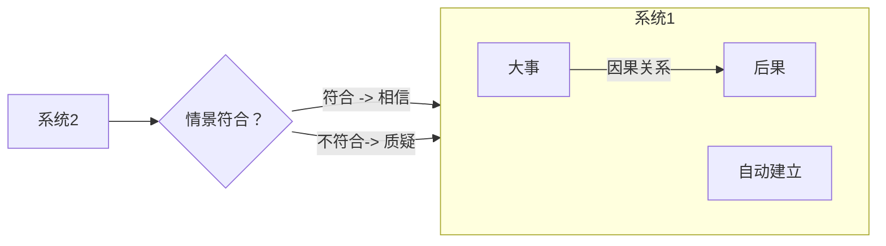

# 第六章 意料之外与情理之中

## 从第一次的惊喜到第二次的习以为常

```mermaid

flowchart TD
  A[联想]
  B[结果]
  C[模式]
  D[期望]
  E[系统1 的主要功能]
  F[维护并更新你个人世界的模式，它呈现的都是常态下的思维模式] -.-> E
  
  
  A-->|构成|C
  B-->|构成|C
  G1[理解]
  G2[期望]
  C-->|对当下|G1
  C-->|对未来|G2
  
  H1[旅游在外时碰见了一个朋友]-->H2[旅游的时候就会碰见朋友]--> H3[再次旅行碰见朋友就不会很惊讶]
  H1--> H4[惊讶]
  H3--> H5[不是很惊讶]
  
  style H1 fill:#f9f,stroke:#333,stroke-width:4px
  style H2 fill:#bbf,stroke:#f66,stroke-width:2px,color:#fff,stroke-dasharray: 5 5

```

## 简的钱包是怎么丢的

一件大事必然带来一些后果，

一些后果也需要一些原因对其做出解释。

系统1 会自动的对 大事 和 后果 之间建立 因果联系。

系统2 有时会接受 系统1自动建立的联想，  有时也会质疑。

```mermaid

graph LR
  subgraph 系统1
    direction LR
    A[大事] -->|因果关系|B[后果]
    E[自动建立]
  end
  
  C[系统2] --> D{情景符合？}
  D-->|符合 -> 相信| 系统1
  D-->|不符合-> 质疑| 系统1

```